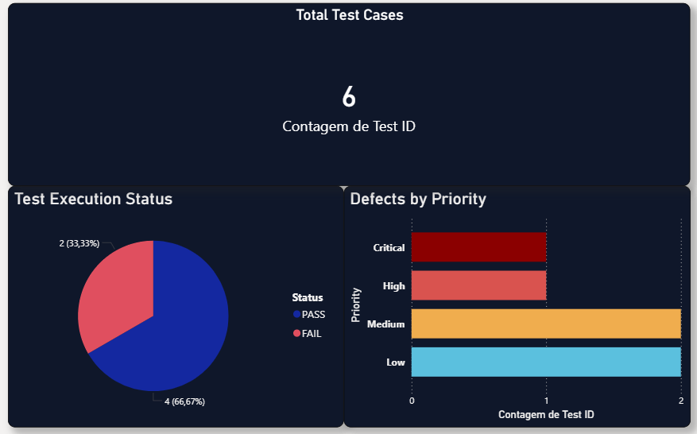
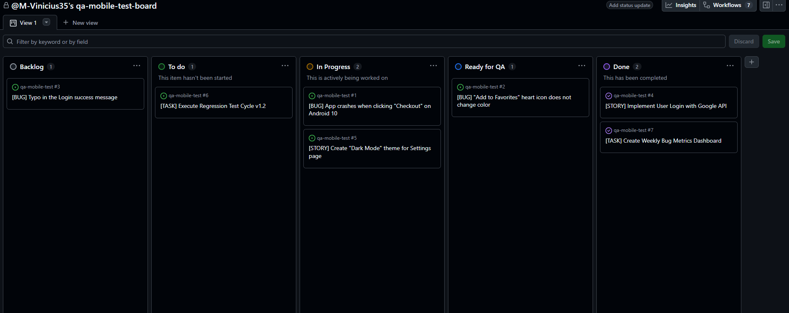

# 📱 Mobile QA Portfolio: E-commerce Test Suite

### 🎯 Project Goal
This project simulates the Quality Assurance cycle for a mobile e-commerce application (Android Environment). The goal is to demonstrate competency in **Bug Tracking**, **Regression Testing**, and **QA Metrics Analysis**.

---

### 🛠️ Tools & Technologies
* **Methodology:** Agile / Scrum
* **Bug Tracking:** GitHub Projects (Simulating Jira)
* **Documentation:** Excel (Test Plans & Regression Scenarios)
* **Data Analysis:** Power BI (Defect Metrics Dashboard)
* **Environment:** Android 13 / Samsung Galaxy S22

---

### 📊 1. QA Metrics Dashboard (Power BI)
*Demonstrates the ability to track bug severity and testing progress.*

> **Key Insight:** 33% of the reported bugs were Critical, requiring immediate attention from the development team before the release.

---

---

### 📋 2. Agile Workflow Management (Jira Simulation)
*Demonstrates organization using Kanban boards to manage the Bug Lifecycle.*

* **Workflow:** Backlog → To Do → In Progress → Ready for QA → Done.
* **Artifacts:** Includes Bug Reports, User Stories, and QA Tasks.

---

### 🧪 3. Test Plan & Regression
*Detailed scenarios to ensure new features (e.g., Dark Mode) didn't break existing functionalities.*

📂 **[Click here to view the full Excel Test Plan](Test_Plan_Regression.xlsx)**

**Sample Scenario (Regression):**
* **Test ID:** TC-002
* **Scenario:** Validate Checkout flow with 1 item.
* **Status:** 🔴 FAIL (Critical Crash detected on Android 10).

---

### 🤖 4. Mobile Automation
This section features a sample automation script developed with **Python** and **Appium** to demonstrate my technical approach to software quality.

* **Objective:** To automate **Regression Testing** on Android devices, ensuring that existing features remain stable after new updates.
* **Methodology:** The script uses `UiAutomator2` to interact with Android elements, simulating a complete user journey (Login Flow).
* **Failure Analysis:** In case of errors, the script is designed to capture logs, aiding in the **identification and reproduction of failures** for the development team.
* **Key Value:** Focused on the lesson that *"Quality is Communication"*, these scripts aim to provide fast and clear feedback to stakeholders.

📂 **[Click here to view the full Script](Automation_Scripts.py)**

---

### 👤 Author
Developed by **Marcelo Carvalho**
*Focusing on Software Quality, Data Analysis, and Process Improvement.*

# **VERSÃO EM PORTUGUÊS**

# 📱 Portfólio de QA Mobile: Suíte de Testes E-commerce

### 🎯 Objetivo do Projeto
Este projeto simula o ciclo de Garantia de Qualidade (QA) para um aplicativo de e-commerce mobile (Ambiente Android). O objetivo é demonstrar competência em **Rastreamento de Bugs**, **Testes de Regressão** e **Análise de Métricas de QA**.

---

### 🛠️ Ferramentas e Tecnologias
* **Metodologia:** Ágil / Scrum
* **Gestão de Bugs:** GitHub Projects (Simulando o Jira)
* **Documentação:** Excel (Planos de Teste e Cenários de Regressão)
* **Análise de Dados:** Power BI (Dashboard de Métricas de Defeitos)
* **Ambiente:** Android 13 / Samsung Galaxy S22

---

### 📊 1. Dashboard de Métricas de QA (Power BI)
*Demonstra a habilidade de monitorar a gravidade dos bugs e o progresso dos testes.*

> **Destaque:** 33% dos bugs reportados foram classificados como Críticos, exigindo atenção imediata da equipe de desenvolvimento antes do lançamento (release).

---

### 📋 2. Gestão de Fluxo Ágil (Simulação Jira)
*Demonstra organização utilizando quadros Kanban para gerenciar o Ciclo de Vida do Bug.*

* **Fluxo de Trabalho:** Backlog → A Fazer (To Do) → Em Progresso → Pronto para QA → Concluído (Done).
* **Artefatos:** Inclui Relatórios de Bugs, Histórias de Usuário e Tarefas de QA.

---

### 🧪 3. Plano de Testes e Regressão
*Cenários detalhados para garantir que novas funcionalidades (ex: Modo Escuro) não quebrem funcionalidades existentes.*

📂 **[Clique aqui para ver o Plano de Testes completo em Excel](Test_Plan_Regression.xlsx)**

**Exemplo de Cenário (Regressão):**
* **ID do Teste:** TC-002
* **Cenário:** Validar fluxo de Checkout com 1 item.
* **Status:** 🔴 FALHA (Crash Crítico detectado no Android 10).

---
### 🤖 4. Automação Mobile
Esta seção apresenta um exemplo de script de automação desenvolvido com **Python** e **Appium** para demonstrar minha abordagem técnica em qualidade de software.

* **Objetivo:** Automatizar **Testes de Regressão** em dispositivos Android, garantindo que as funcionalidades existentes permaneçam estáveis após novas atualizações.
* **Metodologia:** O script utiliza `UiAutomator2` para interagir com elementos Android, simulando uma jornada completa do usuário (Fluxo de Login).
* **Análise de Falhas:** Em caso de erros, o script é projetado para capturar logs, auxiliando na **identificação e reprodução de falhas** para a equipe de desenvolvimento.
* **Valor Principal:** Focado no ensinamento de que *"Qualidade é Comunicação"*, esses scripts visam fornecer feedback rápido e claro para as partes interessadas.

📂 **[Clique aqui para ver o Script](Automation_Scripts.py)**

---

### 👤 Autor
Desenvolvido por **Marcelo Carvalho**
*Foco em Qualidade de Software, Análise de Dados e Melhoria de Processos.*
